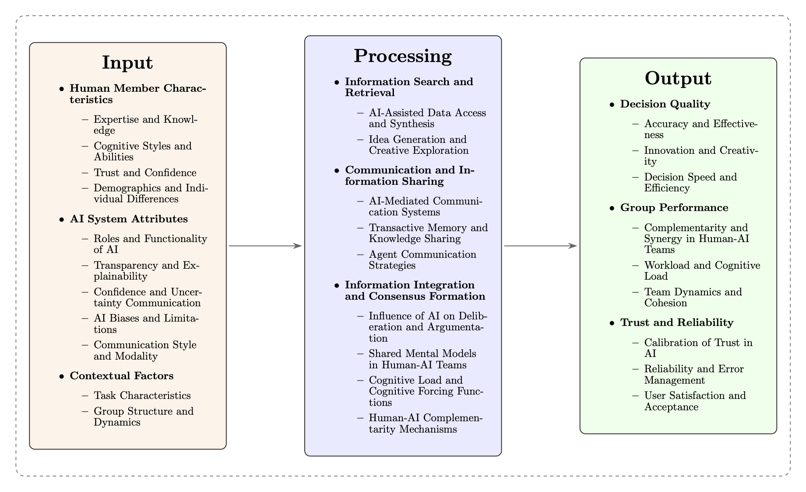

# AI and Group Decision Making: An Information Processing Perspective
Thomas E. Gorman, Torsten Reimer

## Introduction

Artificial Intelligence (AI) is becoming a central component of group
decision-making processes across a range of domains. From healthcare to
finance, education to policymaking, AI systems are being integrated into
group decision-making processes, offering new avenues for enhancing
efficiency, accuracy, and innovation (BaniHani et al., 2024; Burton et
al., 2024; Carter & Wynne, 2024). This growing collaboration between
humans and AI brings forth both significant opportunities and pressing
challenges. On one hand, AI systems offer the potential to enhance
information processing efficiency, improve decision accuracy, and
streamline communication within teams. On the other hand, the
complexities inherent in human-AI interactions—such as issues of trust
and over-reliance, susceptibility to cognitive biases, erosion of
critical thinking skills, lack of transparency in AI algorithms, and
ethical concerns regarding accountability and fairness.

The use of AI in group settings has evolved from basic decision-support
tools to more sophisticated roles, such as collaborative partners
capable of generating novel insights. Large language models (LLMs), for
instance, can facilitate collective intelligence by synthesizing
information, generating alternative solutions, and even mediating group
discussions​​. However, the extent to which AI enhances group performance
remains context-dependent. Recent meta-analyses reveal that human-AI
collaboration can lead to either augmentation of individual performance
or to performance decrements (Vaccaro et al., 2024), depending on the
task and interaction design​​.

To navigate these complexities, this chapter adopts the information
processing framework as a lens for examining AI-assisted group
decision-making (Hinsz et al., 1997). This framework provides a
structured method to analyze how AI systems interact with human
cognitive processes at each stage of decision-making. By dissecting the
inputs (information acquisition and sharing), the processing mechanisms
(interpretation and integration of information), and the outputs
(decisions and actions), we can gain insights into the opportunities and
challenges presented by AI integration.

> [!NONE]
>
> **Box 1: Glossary of Terms**
>
> **Complementarity.** In the context of human-AI teams, complementarity
> refers to the synergistic integration of human and artificial
> intelligence, leveraging the unique strengths of each to achieve
> performance outcomes that exceed those attainable by either humans or
> AI systems operating in isolation (Steyvers et al., 2022). Effective
> complementarity involves a balanced division of labor and mutual
> enhancement of capabilities.
>
> **Information Processing Framework.** A theoretical framework in
> cognitive psychology that conceptualizes the human mind, and by
> extension, groups, as systems that acquire, process, store, retrieve,
> and transmit information, akin to computational systems (Hinsz et al.,
> 1997). This framework provides a structured lens for analyzing
> decision-making as a sequence of stages, from inputs to outputs.
>
> **Large Language Model (LLM).** A sophisticated type of artificial
> intelligence algorithm characterized by its use of deep learning
> techniques and training on massive datasets to enable the
> understanding, generation, and prediction of human language. LLMs,
> such as GPT-4, are foundational to many contemporary AI applications
> in decision support and communication.
>
> **Overreliance.** A cognitive bias characterized by excessive trust in
> and dependence on AI recommendations, often leading to the uncritical
> acceptance of AI outputs, even when they are flawed or suboptimal.
> Overreliance can undermine human vigilance and critical evaluation in
> AI-assisted decision-making contexts.
>
> **Transactive Memory Systems (TMS).** A system of distributed
> knowledge within a group, where members develop specialized knowledge
> and rely on each other for access to that knowledge.

Key questions we will seek to address within this framework::

- **Inputs**: How does AI influence the way groups search for, gather,
  and share information? For example, AI can augment information search
  through advanced data retrieval but may also introduce biases based on
  the algorithms’ training data.

- **Processing**: In what ways do AI systems affect the interpretation
  and integration of information within the group? AI can facilitate
  complex data analysis but might obscure the reasoning process through
  opaque algorithms, impacting the group’s shared understanding.

- **Outputs**: How do AI recommendations influence the group’s final
  decisions and actions? The reliance on AI outputs raises questions
  about trust, accountability, and the potential diminishment of human
  agency.

By examining these questions through the lens of the information
processing framework, we can better understand the complex interplay
between humans and AI in group decision-making contexts and identify
strategies for optimizing the benefits of AI-assisted collaboration
while mitigating its risks.

## Inputs: Resources and Factors Shaping AI-Assisted Group Decision Making

The input stage is characterized by a multifaceted array of resources
and factors, each contributing uniquely to the subsequent processing and
ultimate decision outputs. These inputs can be broadly categorized into
human member characteristics, AI system attributes, task and contextual
factors, and initial trust, expertise assumptions, and biases, each
playing a critical role in shaping the dynamics of human-AI
collaboration.

### Member Characteristics and Roles

**Roles and Functionality of AI**.The roles and functionality assigned
to AI systems significantly impact group dynamics and decision-making
processes (Bennett et al., 2023; Berretta et al., 2023; Carter & Wynne,
2024; Duan et al., 2025; Guo et al., 2024; Nomura et al., 2024). AI can
act as an advisor, providing recommendations and insights; a peer
collaborator, actively participating in discussions; a devil’s advocate,
challenging the group’s assumptions; a mediator, facilitating consensus
formation; or even a manager, coordinating tasks and assigning roles.
The role of the AI will affect how humans interact with it and how much
responsibility is assigned to the AI in the decision-making process.

For instance, an AI acting as an advisor might provide information and
suggestions, which group members then evaluate and integrate into their
decision-making process. In contrast, an AI acting as a peer
collaborator might actively engage in discussions, contributing its own
opinions and analyses. A devil’s advocate AI could challenge the group’s
consensus, promoting critical evaluation and potentially reducing
groupthink. A mediator AI might help to synthesize diverse perspectives
and facilitate agreement, as demonstrated by the Habermas Machine
(Tessler et al., 2024). The proactivity or reactiveness of the AI also
influences its role and impact (Diebel et al., 2025). A proactive AI
might initiate suggestions or interventions, while a reactive AI would
only respond to user prompts. Proactive AI can enhance efficiency but
may also reduce user control and satisfaction, particularly if the AI’s
actions are perceived as intrusive or misaligned with user needs.

Deciding how best to assign team members to roles is crucial in group
decision-making, particularly when learning who is best suited for what
role within a team. Marjieh, Gokhale, et al. (2024) explore how humans
allocate tasks within teams comprising both human and AI agents to
maximize overall performance. The central theme of their research is
understanding the mechanisms by which individuals discern and act upon
their own strengths and those of their team members in a dynamic task
allocation setting. In their experimental paradigm, participants had to
repeatedly allocate three different types of tasks (visual, auditory,
and lexical tasks) between themselves and two AI agents. Unbeknownst to
participants, each AI agent was configured to have high competence (70%
success rate) in one task type but low competence (15% success rate) in
others.

Building upon this, McNeese et al. (2023) argue that human-autonomy
teams (HATs) should be recognized as distinct from traditional human
teams. They emphasize that HATs should not strive to replicate
human-human team dynamics but instead should leverage the unique
capabilities of AI agents. The authors propose several research
trajectories to advance our understanding of HATs, including exploring
diverse teaming models, redefining roles for AI teammates, expanding
communication modalities, focusing on AI behavior design, developing
specialized training, and emphasizing teamwork in AI design. These
insights highlight the necessity of adjusting our approaches to team
composition and role assignment when AI agents are involved, ensuring
that both human and AI strengths are optimized in the decision-making
process.

Recent advances in large language models have dramatically expanded the
potential roles of AI in group decision-making, enabling AI agents to
move beyond simple advisory functions to serve as mediators, devil’s
advocates, and active discussion participants. Chiang et al. (2024)
investigated the potential of Large Language Models (LLMs) to act as
devil’s advocates in AI-assisted group decision-making - in the hopes of
fostering more critical engagement with AI assistance. In their
experimental task, participants were first individually trained on the
relationship between defendant profiles and recidivism. For each
defendant, participants were also shown the prediction of a
recommendation AI model (RiskComp). Participants were then sorted into
groups of three, where they reviewed and discussed novel defendant
profiles, before making a group recidivism assessment. In the group
stage, the recommendations from the RiskComp model were biased against a
subset of the defendants (black defendants with low prior crime counts).
Of interest was whether the inclusion of an LLM-based devil’s advocate
in the group discussions could help mitigate the bias introduced by the
RiskComp AI model (note that the LLM devils advocate and RiskComp AI are
separate AI models). The experimental manipulation consisted of four
variants of an LLM-based devil’s advocate using, varying both the target
of objection (challenging either RiskComp recommendations or majority
group opinions) and the level of interactivity (static one-time comments
versus dynamic engagement throughout the discussions). Their findings
revealed that the dynamic devil’s advocate led to higher decision
accuracy and improved discernment of when to trust the RiskComp model’s
advice.

**Human Member Characteristics.** The composition of human teams, in
terms of expertise, cognitive styles, and diversity, represents a
foundational input layer. For instance, the expertise and knowledge that
individual members bring to a team are crucial determinants of the
quality of information available for processing (Aggarwal et al., 2023),
influencing the depth and breadth of the group’s understanding of the
decision context. Furthermore, cognitive diversity, encompassing varied
approaches to problem-solving and information processing, can enrich the
group’s cognitive resources, potentially enhancing its ability to tackle
complex problems (Aggarwal et al., 2023). However, the benefits of
diversity are not unqualified, as factors such as team longevity and
task complexity can moderate the diversity-performance relationship
(Wallrich et al., 2024). In addition to expertise and cognitive styles,
the roles assigned to team members, particularly in hierarchical
structures, shape how information is accessed, shared, and utilized
within the group (Marjieh, Sucholutsky, et al., 2024; Narayanan et al.,
2023). Moreover, demographic diversity, while having a statistically
significant but practically small overall effect on team performance,
can interact with contextual factors to influence group dynamics and
outcomes (Wallrich et al., 2024). These varied human characteristics
collectively form a crucial input layer, setting the stage for how
groups interact with and leverage AI in decision-making processes.

**Demographics and Individual Differences**. Demographic factors such as
age, gender, and education, as well as individual differences in
personality traits, digital affinity, and cultural background, can
moderate human-AI interaction (Diebel et al., 2025; Gerlich, 2025;
Roesler et al., 2024). For instance, younger individuals or those with
higher digital affinity may be more comfortable integrating AI into
their decision-making processes. Cultural background can also play a
role, influencing attitudes towards authority, technology, and
collaboration (Chugunova & Sele, 2022).

**Task and Contextual Factors.** The nature of the decision-making task
itself and the broader context within which it is embedded form another
essential layer of inputs. Task complexity, for instance, significantly
influences the type of information processing required and the potential
benefits of AI assistance (Eigner & Händler, 2024; Hamada et al., 2020).
Complex tasks may necessitate more sophisticated AI support to manage
information overload and enhance analytical capabilities. The decision
environment, encompassing factors such as time pressure and risk levels,
also shapes the input requirements and the dynamics of human-AI
interaction (Zhang et al., 2023). For example, time pressure may alter
reliance on AI assistance, as individuals adapt their decision-making
strategies to balance speed and accuracy (Swaroop et al., 2024).
Moreover, the specific decision-making setting, whether in healthcare,
finance, or policy, introduces unique contextual factors that influence
the relevance and effectiveness of AI inputs (Narayanan et al., 2023).
These task and contextual factors, therefore, represent a critical input
layer, moderating the interplay between human and AI contributions.

### Initial Trust, Expertise Assumptions, and Biases

- Trust Baselines: Pre-existing attitudes toward AI, perceived
  reliability, anthropomorphism (Cui & Yasseri, 2024)

- Bias and Training Data: Potential for AI to introduce or amplify
  biases from training corpora (Bhatia, 2024; Cecil et al., 2024)

### Information Search

The information search stage of decision-making, once reliant on human
capacity to locate and synthesize data, has been transformed by the
advent of artificial intelligence (AI), particularly Large Language
Models (LLMs). This section explores how AI reshapes information search,
augmenting both data retrieval and synthesis, and fostering idea
generation and creative discovery.

#### AI-Assisted Data Retrieval and Synthesis

LLMs significantly enhance the efficiency and comprehensiveness of
information gathering, enabling access to a broader knowledge base and
deeper insights (Bouschery et al., 2023). These models process vast
datasets, identifying connections and patterns beyond human capacity.
Furthermore, individual differences, such as computational thinking
skills, influence how users interact with LLMs, with those possessing
higher creativity and algorithmic thinking more effectively leveraging
AI-generated content for deeper engagement within a specific information
landscape (Flores et al., 2024). Programmers, for example, navigate
between traditional web search and generative AI tools, strategically
selecting between them based on factors like task familiarity and goal
clarity, demonstrating the synergistic use of both resources (Yen et
al., 2024). DiscipLink, for instance, uses LLMs to generate exploratory
questions across disciplines, automatically expand queries with
field-specific terminology, and extract themes from retrieved papers,
effectively bridging knowledge gaps in interdisciplinary research (Zheng
et al., 2024). Moreover, AI facilitates advanced techniques like
retrieval-augmented generation (RAG), allowing LLMs to access and
process real-time information, enhancing the accuracy and relevance of
their output (Si et al., 2024; Wang et al., 2024). This capability
empowers decision-makers with synthesized insights from diverse sources,
crucial for informed choices across various fields, from scientific
research to policy analysis (Burton et al., 2024).

LLM-based search tools offer natural language interfaces, streamlining
complex queries and providing detailed responses, often leading to
increased efficiency and user satisfaction (Spatharioti et al., 2023).
However, this ease of use can also lead to overreliance on potentially
inaccurate information and decreased critical evaluation, particularly
when presented conversationally (Anderl et al., 2024). This can
contribute to confirmation bias and the formation of “generative echo
chambers,” limiting exposure to diverse perspectives (Sharma et al.,
2024). Furthermore, while LLMs can reduce cognitive load during
information seeking, this may come at the cost of deeper learning and
engagement with the material, leading to less sophisticated reasoning
and argumentation (Stadler et al., 2024). Therefore, careful design and
implementation are crucial to mitigate these risks and leverage the full
potential of LLMs for enhanced information retrieval and synthesis.

### Future Research Directions (Inputs)

Future research should address several gaps in our understanding of
inputs in human-AI group decision-making.

1.  **Interplay of Input Categories:** A more detailed exploration of
    the interplay between different input categories is warranted. This
    includes investigating how human characteristics interact with
    specific AI system attributes within varying contextual demands. For
    instance, how does the level of human expertise moderate the impact
    of AI transparency on trust and reliance? How do different
    communication modalities influence the integration of AI advice in
    groups with varying cognitive styles?
2.  **Longitudinal Studies:** There is a need for longitudinal studies
    to investigate the long-term effects of input factors on the
    evolution of human-AI team dynamics and decision-making strategies
    over time. How do initial trust, expertise assumptions, and biases
    change with repeated interactions? How do groups adapt their
    communication patterns and shared mental models as they gain
    experience working with AI systems?
3.  **Dynamic Role Adjustment:** Research should explore dynamic role
    adjustment in human-AI teams, where roles are not fixed but can
    change based on the task demands and the performance of individual
    team members. This includes developing metrics to evaluate the
    effectiveness of AI-augmented team structures. Such metrics should
    go beyond traditional measures of team performance and consider
    factors like trust, communication quality, and the development of
    shared mental models.

## Information Processing

The processing stage reveals the complex mechanisms through which humans
and AI interact and transform information into collective decisions.

#### AI in Idea Generation and Creative Discovery

AI’s role extends beyond data retrieval to fostering creative discovery.
LLMs act as catalysts, offering alternative perspectives, challenging
assumptions, and proposing unexpected connections (Bouschery et al.,
2023). In structured tasks like semantic search, AI agents enhance group
performance by selectively sharing information, amplifying collective
intelligence (Ueshima & Takikawa, 2024). Studies comparing human and
AI-generated ideas reveal a nuanced picture: while LLMs excel at
generating ideas with higher average quality (e.g., purchase intent) and
even surpassing human experts in novelty (Joosten et al., 2024; Meincke
et al., 2024; Si et al., 2024), they may exhibit lower feasibility
(Joosten et al., 2024) and reduced diversity (Meincke et al., 2024).
This highlights the importance of strategic prompt engineering, as
demonstrated by Boussioux et al. (2024), who found that human-guided
prompts—specifically differentiated search (i.e., prompts designed to
encourage diverse and varied responses) — enhanced the novelty of
LLM-generated solutions while maintaining high value.

The type of AI interaction also significantly influences human
creativity. Ashkinaze et al. (2024) found that exposure to AI-generated
ideas increased the diversity of collective ideas without affecting
individual creativity. In contrast, Kumar et al. (2024) observed that
while providing direct answers had minimal negative impact, exposure to
LLM-generated strategies decreased both originality and creative
flexibility in subsequent unassisted tasks.

### Communication; information sharing

Transactive memory systems (TMS) represent a critical aspect of group
cognition, referring to the shared understanding within a group
regarding the distribution of knowledge and expertise among its members
(Wegner, 1987; Yan et al., 2021). A well-functioning TMS enables team
members not only to know who possesses specific knowledge but also to
access and share this distributed expertise efficiently.

Bienefeld et al. (2023) conducted an observational study to examine the
role of transactive memory systems and speaking-up behaviors in human-AI
teams within an intensive care unit (ICU) setting. In this study, ICU
physicians and nurses, divided into groups of four, who collaborated
with an AI agent named “Autovent.” Autovent is an auto-adaptive
ventilator system that autonomously manages patient ventilation by
processing continuous, individualized data streams. Participants, all
with a minimum of six months’ experience using Autovent, engaged in
simulated clinical scenarios that required diagnosing and treating
critically ill patients. Using behavioral coding of video recordings,
the researchers analyzed how team members accessed information from both
human teammates and the AI system, investigating how these human-human
and human-ai interactions related to subsequent behaviors like
hypothesis generation and speaking up with concerns. The researchers
found that in higher-performing teams, accessing knowledge from the AI
agent was positively correlated with developing new hypotheses and
increased speaking-up behavior. Conversely, accessing information from
human team members was negatively associated with these behaviors,
regardless of team performance. These results suggest that AI systems
may serve as unique knowledge repositories that help teams overcome some
of the social barriers that typically inhibit information sharing and
voice behaviors in purely human teams.

Bastola et al. (2024) further explored the potential of AI-mediated
communication by examining how an LLM-based Smart Reply (LSR) system
could impact collaborative performance in professional settings. They
developed a system utilizing ChatGPT to generate context-aware,
personalized responses during workplace interactions, aiming to reduce
the cognitive effort required for message composition in multitasking
scenarios. In their study, participants engaged in a cognitively
demanding Dual N-back task while managing scheduling activities via
Google Calendar and responding to simulated co-workers on Slack. The
findings indicated that the use of the LSR system not only improved work
performance—evidenced by higher accuracy in the N-back task—but also
increased messaging efficiency and reduced cognitive load, as
participants could more readily focus on primary tasks without the
distraction of composing responses. However, it is important to note
that participants expressed concerns about the appropriateness and
accuracy of AI-generated messages, as well as issues related to trust
and privacy. Thus, while AI-mediated communication tools like the LSR
system may facilitate information sharing and alleviate cognitive
demands in collaborative work, these benefits must be balanced against
potential user experience challenges to fully realize their potential
advantages.

- (Yang et al., 2024)

- (Ma et al., 2024)

- (Radivojevic et al., 2024)

- (Sidji et al., 2024)

- (Nishida et al., 2024)

- (Chuang et al., 2024)

- AI-Mediated Communication: Smart replies, devil’s advocacy, and AI as
  a discussion facilitator (Chiang et al., 2024; Duan et al., 2025)

- Transactive Memory and Shared Mental Models: How AI systems function
  as external knowledge repositories (Bienefeld et al., 2023; Narayanan
  & Feigh, 2024)

- chat-based collaboration (ChatCollab, Klieger et al., 2024)

### Shared Mental Models

- (Collins et al., 2024)

- role of shared mental models in effective teamwork (N. J. McNeese et
  al., 2023; Narayanan & Feigh, 2024).

- challenge of developing shared mental models in human-AI teams due to
  the opacity of AI reasoning (Collins et al., 2024; S. Zhang et al.,
  2024).

- potential solutions, such as increasing AI transparency, providing
  explanations, or using interactive interfaces (Chiang et al., 2024;
  Klieger et al., 2024; Ma et al., 2024; Sidji et al., 2024).

- Role of training in developing effective mental models of AI and in
  calibrating trust (Kelly et al., 2023; Tejeda et al., 2022).

Future Directions: Research on how to measure and visualize shared
mental models in human-AI teams, how to design AI systems that actively
contribute to the development of shared understanding, how to adapt AI
behavior based on the evolving mental models of human teammates.

### Cognitive Load

AI assistance can influence the workload and cognitive load experienced
by human team members (Bastola et al., 2024; Buçinca et al., 2021; Choi
et al., 2024; Gerlich, 2025). While AI can reduce cognitive load by
automating certain tasks and providing ready-made solutions (Hao et al.,
2024), it can also increase cognitive load if the AI interface is poorly
designed or if the AI’s reasoning is opaque (Buçinca et al., 2021;
Westphal et al., 2023).

Buçinca et al. (2021) examined how interface design might influence
cognitive engagement with AI recommendations through what they term
“cognitive forcing functions.” Drawing on dual-process theory, they
implemented three distinct interface interventions (e.g., requiring
explicit requests for AI input, mandating initial independent decisions,
introducing temporal delays) designed to disrupt automatic processing
and promote more analytical engagement with AI suggestions. Their
findings demonstrated that while these interventions successfully
reduced overreliance on incorrect AI recommendations, they also
increased perceived cognitive load and decreased user satisfaction. Of
particular methodological interest was their systematic investigation of
individual differences in cognitive motivation: participants with high
Need for Cognition (NFC) showed substantially greater benefits from
these interventions, suggesting that the effectiveness of such cognitive
load manipulations may be moderated by individual differences in
information processing preferences.

- Cognitive Load and Overreliance: Role of interface design in prompting
  deeper analytic thinking (Buçinca et al., 2021; Vodrahalli et al.,
  2022)

- Cognitive offloading effects (Stadler et al., 2024)

### Consensus Formation

Tessler et al. (2024) investigated the potential of AI in facilitating
consensus formation through their development of the “Habermas Machine”
(HM), an LLM-based system fine-tuned to mediate human deliberation. The
HM system receives input statements from individual participants, and
attempts to generate consensus statements which will maximize group
endorsement. The findings revealed that the AI-generated group
statements were consistently preferred over comparison statements
written by human mediators. Participants rated the AI-mediated
statements higher in terms of informativeness, clarity, and lack of
bias. This suggests that AI can effectively capture the collective
sentiment of a group and articulate it in a way that resonates with its
members. Notably, the researchers also verified that the HM system
reliably incorporated minority opinions into the consensus statements,
preventing dominance by majority perspectives. These results were
replicated in a virtual citizens’ assembly with a demographically
representative sample of the UK population. The AI-mediated process
again resulted in high-quality group statements and facilitated
consensus among participants on contentious issues.

### Future Research Directions (Processing)

Future research should address several gaps in our understanding of
cognitive processing in human-AI teams.

1.  **Dynamic Interplay:** A deeper understanding of the dynamic
    interplay between different processing mechanisms is needed. This
    includes investigating how AI-mediated communication shapes shared
    mental models and how cognitive load influences information
    integration.
2.  **Emotions and Social Factors:** The role of emotions and social
    factors in human-AI information processing should be explored. How
    do factors like trust, rapport, and social identity influence the
    way humans interact with and rely on AI teammates?
3.  **Adaptive AI Systems:** More research is needed on how to design AI
    systems that can adapt to the cognitive styles and abilities of
    individual human team members. This includes developing personalized
    AI interfaces that provide tailored explanations, adjust the level
    of interactivity, and offer appropriate cognitive support.

## Output

### Decision Accuracy and Complementarity

The integration of AI into group decision-making holds significant
promise for leveraging the complementary strengths of humans and
machines. Rastogi et al. (2023) proposed a taxonomy to characterize
differences in human and machine decision-making, providing a framework
for understanding how to combine their unique capabilities optimally.
This taxonomy highlights areas where AI can augment human decision
processes, such as handling large data sets or identifying patterns
beyond human perceptual abilities. Becker et al. (2022) demonstrated
that AI-generated decision aids, when presented as interpretable
procedural instructions, can significantly improve human decision-making
by promoting more resource-rational strategies. In complex domains, Shin
et al. (2023) showed that exposure to superhuman AI, as in the game of
Go, can enhance human decision-making by encouraging the exploration of
novel strategies, thereby increasing overall performance and innovation.
However, the effectiveness of human-AI collaboration depends on the
dynamics of the interaction.

Recent research has revealed complex trade-offs in human-AI team
performance that depend heavily on task structure and collaboration
dynamics. Bennett et al. (2023) found that while both human-human and
human-AI teams experienced performance costs relative to theoretical
benchmarks, human-human teams showed particular advantages in
collaborative versus competitive conditions—an effect that diminished
when humans worked with AI partners. This aligns with findings from
Liang et al. (2022) showing that humans can learn to selectively rely on
AI assistance based on task difficulty, but often require explicit
feedback and training to optimize this collaboration. The reduced
collaborative advantage in human-AI teams appears to stem from
difficulties in developing shared mental models and coordinating actions
effectively, suggesting that current AI systems may lack crucial
capabilities for fluid team interaction.

- Performance Gains and Limits: Complementarity vs. overreliance (Liang
  et al., 2022)

## Trust, Risk and Reliance

### Trust in AI

Trust and confidence are crucial determinants of how individuals and
groups interact with AI systems during decision-making processes.
Research indicates that individuals’ confidence levels significantly
influence their propensity to seek and utilize AI-generated advice.
Pescetelli & Yeung (2021) found that people are more likely to seek
advice when their confidence in their own decisions is low; however,
they often deviate from optimal Bayesian integration when incorporating
this advice, sometimes relying on heuristic strategies instead.
Carlebach & Yeung (2023) further demonstrated that the relationship
between confidence and advice-seeking is context-dependent. When the
reliability of an AI advisor is unknown, individuals may paradoxically
seek advice even when they are confident, using their own confidence as
a feedback mechanism to learn about the advisor’s quality. Liang et al.
(2022) explored how explicit performance comparisons between humans and
AI affect reliance on decision aids, revealing that individuals adapt
their use of AI recommendations based on task difficulty and perceived
accuracy differences. Steyvers et al. (2024) demonstrated that humans
tend to overestimate AI system accuracy when presented with default
explanations, particularly when those explanations are lengthy. However,
this miscalibration can be mitigated by explicitly communicating the
AI’s uncertainty levels.

In group settings, trust in AI systems significantly influences how
teams interact and make decisions. Cui & Yasseri (2024) emphasize that
trust between humans and AI is crucial for achieving collective
intelligence in teams. They argue that factors such as the perceived
competence, benevolence, and integrity of AI systems shape this trust,
mirroring the dynamics of trust in human relationships. The level of
anthropomorphism in AI agents can also affect trust; while human-like
features may initially enhance trust, this effect can wane if the AI’s
performance does not meet team expectations. Zvelebilova et al. (2024)
further demonstrate that even when teams do not fully trust an AI
assistant or consider it a genuine team member, the AI can still
significantly influence team discourse and collective attention. Their
study found that teams adopted terminology introduced by the AI,
indicating an automatic integration of AI input despite doubts about its
reliability. This suggests that AI systems can impact group cognition
and coordination regardless of explicit trust levels. These findings
highlight the complexity of trust in AI within team environments, where
both the design of AI agents and their subtle influences on team
dynamics must be carefully managed to enhance collaborative outcomes.

- Contagion Effects of (Dis)Trust: Spread of distrust or overconfidence
  within human–AI teams (Duan et al., 2025)

- Uncalibrated vs. Well-Calibrated AI: Conditions under which
  uncalibrated AI might paradoxically enhance outcomes (Vodrahalli et
  al., 2022)

### Utilization

Recent work by Buçinca et al. (2021) presents an innovative approach to
addressing overreliance on AI systems through interface design rather
than explanation quality. Their study evaluated three “cognitive forcing
functions” - interface elements designed to disrupt quick, heuristic
processing of AI recommendations. Although these interventions
significantly reduced overreliance on incorrect AI recommendations, an
important trade-off emerged: interfaces that most effectively prevented
overreliance were also rated as most complex and least preferred by
users. Moreover, their analysis revealed potential equity concerns, as
the interventions provided substantially greater benefits to individuals
with high Need for Cognition. These findings suggest that while
interface design can effectively modulate AI utilization patterns,
careful consideration must be given to both user experience and
potential intervention-generated inequalities.

### Responsibility

- (Narayanan et al., 2023)

Recent work has begun examining how people attribute responsibility in
human-AI collaborative contexts where control is shared and actions are
interdependent (Tsirtsis et al., 2024). Their study employs a stylized
semi-autonomous driving simulation where participants observe how a
‘human agent’ and an ‘AI agent’ collaborate to reach a destination
within a time limit. In their setup, the human and AI agents shared
control of a vehicle, with each agent having partial and differing
knowledge of the environment (i.e., the AI knew about traffic conditions
but not road closures, while humans knew about closures but not
traffic). Participants observe illustrated simulations of a variety of
commute scenarios, and then make judgements about how responsible each
agent was for the commute outcome (reaching the destination on time, or
not). The study reveals that participants’ responsibility judgments are
influenced by factors such as the unexpectedness of an agent’s action,
counterfactual simulations of alternative actions, and the actual
contribution of each agent to the task outcome.

### Risk

- (Bhatia, 2024)
- (Zhu et al., 2024)

## Future Directions

- Opportunities for real-time AI moderation (Han et al., 2024)
- Evolving norms around AI accountability (Smith et al., 2025)
- potential negative impacts of AI on human skills, critical thinking,
  and agency (Gerlich, 2025; H. Kumar et al., 2024)
- Effects of AI on group extremity and the emergence of echo chambers or
  polarization phenomena (van Swol et al., 2023).
- privacy, accountability, and fairness in AI-assisted group decision
  making (Cui & Yasseri, 2024; Barredo Arrieta et al., 2020).

## References

Aggarwal, I., Cuconato, G., Ateş, N. Y., & Meslec, N. (2023).
Self-beliefs, Transactive Memory Systems, and Collective Identification
in Teams: Articulating the Socio-Cognitive Underpinnings of COHUMAIN.
*Topics in Cognitive Science*, 1–31.
<https://doi.org/10.1111/tops.12681>

Anderl, C., Klein, S. H., Sarigül, B., Schneider, F. M., Han, J.,
Fiedler, P. L., & Utz, S. (2024). Conversational presentation mode
increases credibility judgements during information search with ChatGPT.
*Scientific Reports*, *14*(1), 17127.
<https://doi.org/10.1038/s41598-024-67829-6>

Ashkinaze, J., Mendelsohn, J., Qiwei, L., Budak, C., & Gilbert, E.
(2024). *How AI Ideas Affect the Creativity, Diversity, and Evolution of
Human Ideas: Evidence From a Large, Dynamic Experiment*
(arXiv:2401.13481). arXiv. <https://doi.org/10.48550/arXiv.2401.13481>

BaniHani, I., Alawadi, S., & Elmrayyan, N. (2024). AI and the
decision-making process: A literature review in healthcare, financial,
and technology sectors. *Journal of Decision Systems*, 1–11.
<https://doi.org/10.1080/12460125.2024.2349425>

Bastola, A., Wang, H., Hembree, J., Yadav, P., Gong, Z., Dixon, E.,
Razi, A., & McNeese, N. (2024). *LLM-based Smart
Reply (LSR): Enhancing Collaborative Performance with
ChatGPT-mediated Smart Reply System*
(arXiv:2306.11980). arXiv. <https://arxiv.org/abs/2306.11980>

Becker, F., Skirzyński, J., van Opheusden, B., & Lieder, F. (2022).
Boosting Human Decision-making with
AI-Generated Decision Aids. *Computational Brain & Behavior*, *5*(4),
467–490. <https://doi.org/10.1007/s42113-022-00149-y>

Bennett, M. S., Hedley, L., Love, J., Houpt, J. W., Brown, S. D., &
Eidels, A. (2023). Human Performance in Competitive and Collaborative
Human–Machine Teams. *Topics in Cognitive Science*, 1–25.
<https://doi.org/10.1111/tops.12683>

Berretta, S., Tausch, A., Ontrup, G., Gilles, B., Peifer, C., & Kluge,
A. (2023). Defining human-AI teaming the human-centered way: A scoping
review and network analysis. *Frontiers in Artificial Intelligence*,
*6*. <https://doi.org/10.3389/frai.2023.1250725>

Bhatia, S. (2024). Exploring variability in risk taking with large
language models. *Journal of Experimental Psychology: General*,
*153*(7), 1838–1860. <https://doi.org/10.1037/xge0001607>

Bienefeld, N., Kolbe, M., Camen, G., Huser, D., & Buehler, P. K. (2023).
Human-AI teaming: Leveraging transactive memory and speaking up for
enhanced team effectiveness. *Frontiers in Psychology*, *14*.
<https://doi.org/10.3389/fpsyg.2023.1208019>

Bouschery, S. G., Blazevic, V., & Piller, F. T. (2023). Augmenting human
innovation teams with artificial intelligence: Exploring
transformer-based language models. *Journal of Product Innovation
Management*, *40*(2), 139–153. <https://doi.org/10.1111/jpim.12656>

Boussioux, L., Lane, J. N., Zhang, M., Jacimovic, V., & Lakhani, K. R.
(2024). The Crowdless Future? Generative AI and Creative
Problem-Solving. *Organization Science*, *35*(5), 1589–1607.
<https://doi.org/10.1287/orsc.2023.18430>

Buçinca, Z., Malaya, M. B., & Gajos, K. Z. (2021). To Trust or to Think:
Cognitive Forcing Functions Can Reduce Overreliance on AI in
AI-assisted Decision-making. *Proceedings of
the ACM on Human-Computer Interaction*, *5*(CSCW1), 1–21.
<https://doi.org/10.1145/3449287>

Burton, J. W., Lopez-Lopez, E., Hechtlinger, S., Rahwan, Z., Aeschbach,
S., Bakker, M. A., Becker, J. A., Berditchevskaia, A., Berger, J.,
Brinkmann, L., Flek, L., Herzog, S. M., Huang, S., Kapoor, S.,
Narayanan, A., Nussberger, A.-M., Yasseri, T., Nickl, P., Almaatouq, A.,
… Hertwig, R. (2024). How large language models can reshape collective
intelligence. *Nature Human Behaviour*, 1–13.
<https://doi.org/10.1038/s41562-024-01959-9>

Carlebach, N., & Yeung, N. (2023). Flexible use of confidence to guide
advice requests. *Cognition*, *230*, 105264.
<https://doi.org/10.1016/j.cognition.2022.105264>

Carter, W., & Wynne, K. T. (2024). Integrating artificial intelligence
into team decision-making: Toward a theory of AI–human team
effectiveness. *European Management Review*.
<https://doi.org/10.1111/emre.12685>

Cecil, J., Lermer, E., Hudecek, M. F. C., Sauer, J., & Gaube, S. (2024).
Explainability does not mitigate the negative impact of incorrect AI
advice in a personnel selection task. *Scientific Reports*, *14*(1),
9736. <https://doi.org/10.1038/s41598-024-60220-5>

Chiang, C.-W., Lu, Z., Li, Z., & Yin, M. (2024). Enhancing AI-Assisted
Group Decision Making through LLM-Powered Devil’s Advocate. *Proceedings
of the 29th International Conference on Intelligent User Interfaces*,
103–119. <https://doi.org/10.1145/3640543.3645199>

Choi, A. S., Akter, S. S., Singh, J. P., & Anastasopoulos, A. (2024).
*The LLM Effect: Are Humans Truly Using LLMs, or Are They Being
Influenced By Them Instead?* (arXiv:2410.04699). arXiv.
<https://arxiv.org/abs/2410.04699>

Chuang, Y.-S., Harlalka, N., Suresh, S., Goyal, A., Hawkins, R., Yang,
S., Shah, D., Hu, J., & Rogers, T. T. (2024). *The Wisdom of Partisan
Crowds: Comparing Collective Intelligence in Humans and
LLM-based Agents*.

Chugunova, M., & Sele, D. (2022). We and It: An interdisciplinary review
of the experimental evidence on how humans interact with machines.
*Journal of Behavioral and Experimental Economics*, *99*, 101897.
<https://doi.org/10.1016/j.socec.2022.101897>

Collins, K. M., Sucholutsky, I., Bhatt, U., Chandra, K., Wong, L., Lee,
M., Zhang, C. E., Zhi-Xuan, T., Ho, M., Mansinghka, V., Weller, A.,
Tenenbaum, J. B., & Griffiths, T. L. (2024). Building machines that
learn and think with people. *Nature Human Behaviour*, *8*(10),
1851–1863. <https://doi.org/10.1038/s41562-024-01991-9>

Cui, H., & Yasseri, T. (2024). AI-enhanced
collective intelligence. *Patterns*, *5*(11), 101074.
<https://doi.org/10.1016/j.patter.2024.101074>

Diebel, C., Goutier, M., Adam, M., & Benlian, A. (2025). When AI-Based
Agents Are Proactive: Implications for Competence and System
Satisfaction in Human–AI Collaboration. *Business & Information Systems
Engineering*, 1–20. <https://doi.org/10.1007/s12599-024-00918-y>

Duan, W., Zhou, S., Scalia, M. J., Freeman, G., Gorman, J., Tolston, M.,
McNeese, N. J., & Funke, G. (2025). Understanding the processes of trust
and distrust contagion in Human-AI Teams: A qualitative approach.
*Computers in Human Behavior*, 108560.
<https://doi.org/10.1016/j.chb.2025.108560>

Eigner, E., & Händler, T. (2024). *Determinants of
LLM-assisted Decision-Making*
(arXiv:2402.17385). arXiv. <https://arxiv.org/abs/2402.17385>

Flores, P., Rong, G., & Cowley, B. (2024). Information foraging in
human-ChatGPT interactions: Factors of computational thinking dissociate
exploration and exploitation. *Proceedings of the Annual Meeting of the
Cognitive Science Society*, *46*.

Gerlich, M. (2025). AI Tools in Society: Impacts on Cognitive Offloading
and the Future of Critical Thinking. *Societies*, *15*(1), 6.
<https://doi.org/10.3390/soc15010006>

Guo, Z., Wu, Y., Hartline, J. D., & Hullman, J. (2024). A Decision
Theoretic Framework for Measuring AI Reliance. *The 2024 ACM Conference
on Fairness, Accountability, and Transparency*, 221–236.
<https://doi.org/10.1145/3630106.3658901>

Hamada, D., Nakayama, M., & Saiki, J. (2020). Wisdom of crowds and
collective decision-making in a survival situation with complex
information integration. *Cognitive Research: Principles and
Implications*, *5*(1), 48. <https://doi.org/10.1186/s41235-020-00248-z>

Hinsz, V. B., Tindale, R. S., & Vollrath, D. A. (1997). The emerging
conceptualization of groups as information processors. *Psychological
Bulletin*, *121*(1), 43–64. <https://doi.org/10.1037/0033-2909.121.1.43>

Joosten, J., Bilgram, V., Hahn, A., & Totzek, D. (2024). Comparing the
Ideation Quality of Humans With Generative Artificial Intelligence.
*IEEE Engineering Management Review*, *52*(2), 153–164.
<https://doi.org/10.1109/EMR.2024.3353338>

Kumar, H., Vincentius, J., Jordan, E., & Anderson, A. (2024). *Human
Creativity in the Age of LLMs: Randomized Experiments on Divergent and
Convergent Thinking* (arXiv:2410.03703). arXiv.
<https://arxiv.org/abs/2410.03703>

Liang, G., Sloane, J. F., Donkin, C., & Newell, B. R. (2022). Adapting
to the algorithm: How accuracy comparisons promote the use of a decision
aid. *Cognitive Research: Principles and Implications*, *7*(1), 14.
<https://doi.org/10.1186/s41235-022-00364-y>

Ma, S., Chen, Q., Wang, X., Zheng, C., Peng, Z., Yin, M., & Ma, X.
(2024). *Towards Human-AI Deliberation: Design and Evaluation of
LLM-Empowered Deliberative AI for AI-Assisted Decision-Making*
(arXiv:2403.16812). arXiv. <https://arxiv.org/abs/2403.16812>

Marjieh, R., Gokhale, A., Bullo, F., & Griffiths, T. L. (2024). *Task
Allocation in Teams as a Multi-Armed Bandit*.

Marjieh, R., Sucholutsky, I., van Rijn, P., Jacoby, N., & Griffiths, T.
L. (2024). Large language models predict human sensory judgments across
six modalities. *Scientific Reports*, *14*(1), 21445.
<https://doi.org/10.1038/s41598-024-72071-1>

McNeese, N. J., Flathmann, C., O’Neill, T. A., & Salas, E. (2023).
Stepping out of the shadow of human-human teaming: Crafting a unique
identity for human-autonomy teams. *Computers in Human Behavior*, *148*,
107874. <https://doi.org/10.1016/j.chb.2023.107874>

Meincke, L., Girotra, K., Nave, G., Terwiesch, C., & Ulrich, K. T.
(2024). *Using Large Language Models for Idea Generation in Innovation*.
<https://doi.org/10.2139/ssrn.4526071>

Narayanan, S., Yu, G., Ho, C.-J., & Yin, M. (2023). How does Value
Similarity affect Human Reliance in AI-Assisted Ethical Decision Making?
*Proceedings of the 2023 AAAI/ACM Conference on AI, Ethics, and
Society*, 49–57. <https://doi.org/10.1145/3600211.3604709>

Nishida, Y., Shimojo, S., & Hayashi, Y. (2024). Conversational Agent
Dynamics with Minority Opinion and Cognitive Conflict in Small-Group
Decision-Making. *Japanese Psychological Research*.
<https://doi.org/10.1111/jpr.12552>

Nomura, M., Ito, T., & Ding, S. (2024). Towards
Collaborative Brain-storming among Humans
and AI Agents: An Implementation of the IBIS-based
Brainstorming Support System with Multiple AI Agents.
*Proceedings of the ACM Collective Intelligence Conference*, 1–9.
<https://doi.org/10.1145/3643562.3672609>

Pescetelli, N., & Yeung, N. (2021). The role of decision confidence in
advice-taking and trust formation. *Journal of Experimental Psychology:
General*, *150*(3), 507–526. <https://doi.org/10.1037/xge0000960>

Radivojevic, K., Clark, N., & Brenner, P. (2024). LLMs Among Us:
Generative AI Participating in Digital Discourse. *Proceedings of the
AAAI Symposium Series*, *3*(1), 209–218.
<https://doi.org/10.1609/aaaiss.v3i1.31202>

Rastogi, C., Leqi, L., Holstein, K., & Heidari, H. (2023). A Taxonomy of
Human and ML Strengths in Decision-Making to Investigate Human-ML
Complementarity. *Proceedings of the AAAI Conference on Human
Computation and Crowdsourcing*, *11*, 127–139.
<https://doi.org/10.1609/hcomp.v11i1.27554>

Roesler, E., Rieger, T., & Langer, M. (2024). Numeric vs. Verbal
information: The influence of information quantifiability in Human-AI
vs. Human-Human decision support. *Computers in Human Behavior:
Artificial Humans*, 100116.
<https://doi.org/10.1016/j.chbah.2024.100116>

Sharma, N., Liao, Q. V., & Xiao, Z. (2024). Generative Echo Chamber?
Effect of LLM-Powered Search Systems on Diverse Information Seeking.
*Proceedings of the CHI Conference on Human Factors in Computing
Systems*, 1–17. <https://doi.org/10.1145/3613904.3642459>

Shin, M., Kim, J., van Opheusden, B., & Griffiths, T. L. (2023).
Superhuman artificial intelligence can improve human decision-making by
increasing novelty. *Proceedings of the National Academy of Sciences*,
*120*(12), e2214840120. <https://doi.org/10.1073/pnas.2214840120>

Si, C., Yang, D., & Hashimoto, T. (2024). *Can LLMs Generate Novel
Research Ideas? A Large-Scale Human Study with 100+ NLP Researchers*
(arXiv:2409.04109). arXiv. <https://doi.org/10.48550/arXiv.2409.04109>

Sidji, M., Smith, W., & Rogerson, M. J. (2024). Human-AI Collaboration
in Cooperative Games: A Study of Playing Codenames with an LLM
Assistant. *Proc. ACM Hum.-Comput. Interact.*, *8*(CHI PLAY),
316:1–316:25. <https://doi.org/10.1145/3677081>

Spatharioti, S. E., Rothschild, D. M., Goldstein, D. G., & Hofman, J. M.
(2023). *Comparing Traditional and LLM-based
Search for Consumer Choice: A Randomized Experiment*
(arXiv:2307.03744). arXiv. <https://doi.org/10.48550/arXiv.2307.03744>

Stadler, M., Bannert, M., & Sailer, M. (2024). Cognitive ease at a cost:
LLMs reduce mental effort but compromise depth in student scientific
inquiry. *Computers in Human Behavior*, *160*, 108386.
<https://doi.org/10.1016/j.chb.2024.108386>

Steyvers, M., Tejeda, H., Kumar, A., Belem, C., Karny, S., Hu, X.,
Mayer, L., & Smyth, P. (2024). *The Calibration Gap between Model and
Human Confidence in Large Language Models* (arXiv:2401.13835). arXiv.
<https://arxiv.org/abs/2401.13835>

Swaroop, S., Buçinca, Z., Gajos, K. Z., & Doshi-Velez, F. (2024).
Accuracy-Time Tradeoffs in AI-Assisted Decision Making under Time
Pressure. *Proceedings of the 29th International Conference on
Intelligent User Interfaces*, 138–154.
<https://doi.org/10.1145/3640543.3645206>

Tessler, M. H., Bakker, M. A., Jarrett, D., Sheahan, H., Chadwick, M.
J., Koster, R., Evans, G., Campbell-Gillingham, L., Collins, T., Parkes,
D. C., Botvinick, M., & Summerfield, C. (2024). AI can help humans find
common ground in democratic deliberation. *Science*, *386*(6719),
eadq2852. <https://doi.org/10.1126/science.adq2852>

Tsirtsis, S., Rodriguez, M. G., & Gerstenberg, T. (2024). *Towards a
computational model of responsibility judgments in sequential human-AI
collaboration*. <https://doi.org/10.31234/osf.io/m4yad>

Ueshima, A., & Takikawa, H. (2024). Discovering Novel Social Preferences
Using Simple Artificial Neural Networks. *Collabra: Psychology*,
*10*(1), 121234. <https://doi.org/10.1525/collabra.121234>

Vaccaro, M., Almaatouq, A., & Malone, T. (2024). When combinations of
humans and AI are useful: A systematic review and meta-analysis. *Nature
Human Behaviour*, 1–11. <https://doi.org/10.1038/s41562-024-02024-1>

Wallrich, L., Opara, V., Wesołowska, M., Barnoth, D., & Yousefi, S.
(2024). The Relationship Between Team Diversity and Team Performance:
Reconciling Promise and Reality Through a Comprehensive Meta-Analysis
Registered Report. *Journal of Business and Psychology*, *39*(6),
1303–1354. <https://doi.org/10.1007/s10869-024-09977-0>

Wang, R., Zhou, X., Qiu, L., Chang, J. C., Bragg, J., & Zhang, A. X.
(2024). *Social-RAG: Retrieving from Group Interactions to Socially
Ground Proactive AI Generation to Group Preferences* (arXiv:2411.02353).
arXiv. <https://doi.org/10.48550/arXiv.2411.02353>

Wegner, D. M. (1987). Transactive Memory: A Contemporary Analysis of the
Group Mind. In B. Mullen & G. R. Goethals (Eds.), *Theories of Group
Behavior* (pp. 185–208). Springer.
<https://doi.org/10.1007/978-1-4612-4634-3_9>

Westphal, M., Vössing, M., Satzger, G., Yom-Tov, G. B., & Rafaeli, A.
(2023). Decision control and explanations in human-AI collaboration:
Improving user perceptions and compliance. *Computers in Human
Behavior*, *144*, 107714. <https://doi.org/10.1016/j.chb.2023.107714>

Yan, B., Hollingshead, A. B., Alexander, K. S., Cruz, I., & Shaikh, S.
J. (2021). Communication in Transactive Memory Systems: A Review and
Multidimensional Network Perspective. *Small Group Research*, *52*(1),
3–32. <https://doi.org/10.1177/1046496420967764>

Yang, Z., Xu, X., Yao, B., Rogers, E., Zhang, S., Intille, S., Shara,
N., Gao, G. G., & Wang, D. (2024). Talk2Care: An
LLM-based Voice Assistant for Communication between Healthcare
Providers and Older Adults. *Proceedings of the ACM on Interactive,
Mobile, Wearable and Ubiquitous Technologies*, *8*(2), 1–35.
<https://doi.org/10.1145/3659625>

Yen, R., Sultanum, N., & Zhao, J. (2024). To Search or To Gen? Exploring
the Synergy between Generative AI and Web Search in Programming.
*Extended Abstracts of the CHI Conference on Human Factors in Computing
Systems*, 1–8. <https://doi.org/10.1145/3613905.3650867>

Zhang, R., Duan, W., Flathmann, C., McNeese, N., Freeman, G., &
Williams, A. (2023). Investigating AI Teammate Communication Strategies
and Their Impact in Human-AI Teams for Effective Teamwork. *Proceedings
of the ACM on Human-Computer Interaction*, *7*(CSCW2), 1–31.
<https://doi.org/10.1145/3610072>

Zheng, C., Zhang, Y., Huang, Z., Shi, C., Xu, M., & Ma, X. (2024).
DiscipLink: Unfolding Interdisciplinary Information Seeking Process via
Human-AI Co-Exploration. *Proceedings of the 37th Annual ACM Symposium
on User Interface Software and Technology*, 1–20.
<https://doi.org/10.1145/3654777.3676366>

Zhu, J.-Q., Yan, H., & Griffiths, T. L. (2024). *Language Models Trained
to do Arithmetic Predict Human Risky and Intertemporal Choice*
(arXiv:2405.19313). arXiv. <https://arxiv.org/abs/2405.19313>

Zvelebilova, J., Savage, S., & Riedl, C. (2024). *Collective Attention
in Human-AI Teams* (arXiv:2407.17489). arXiv.
<https://doi.org/10.48550/arXiv.2407.17489>

